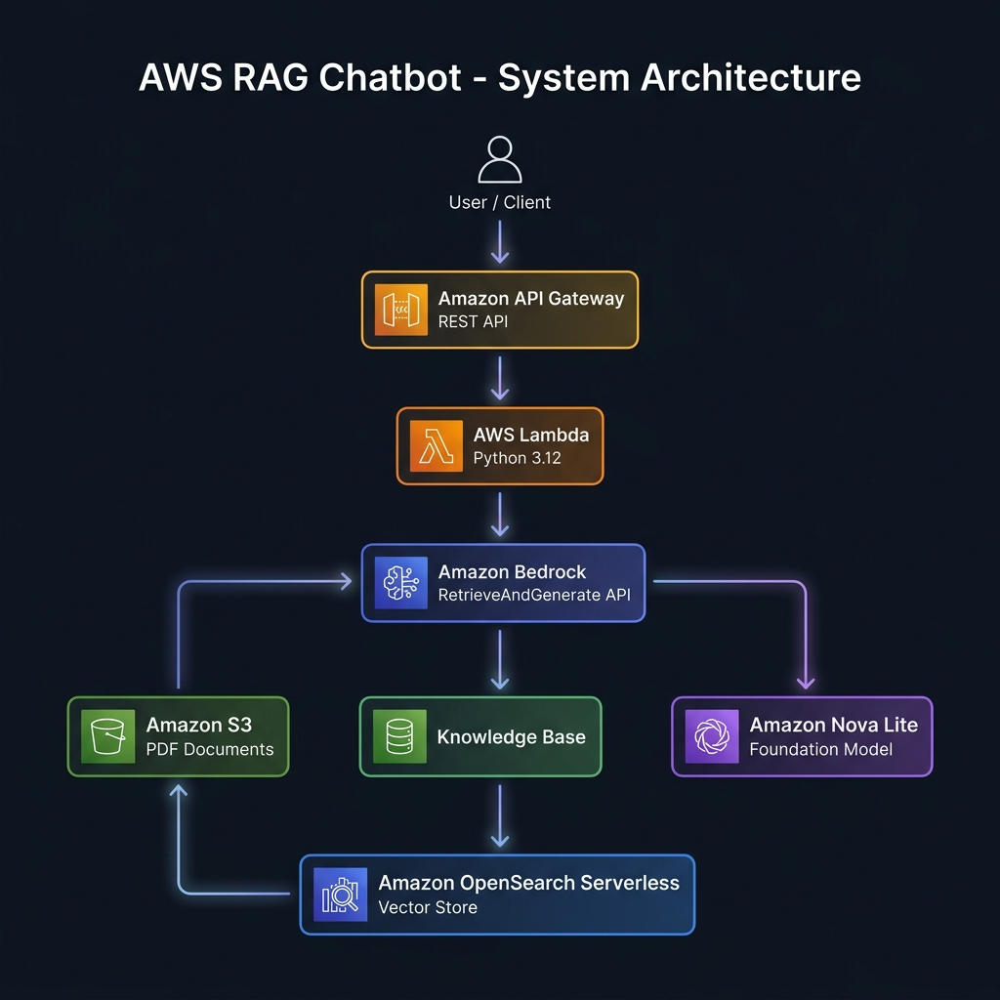
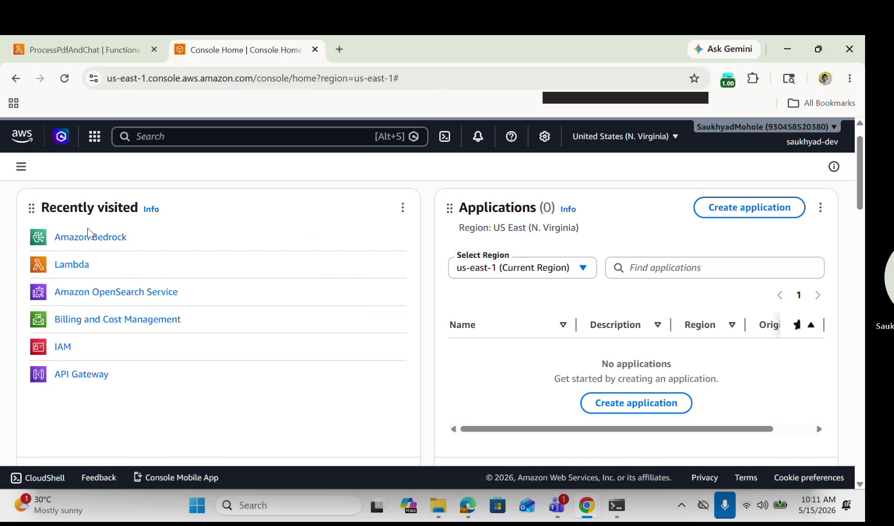
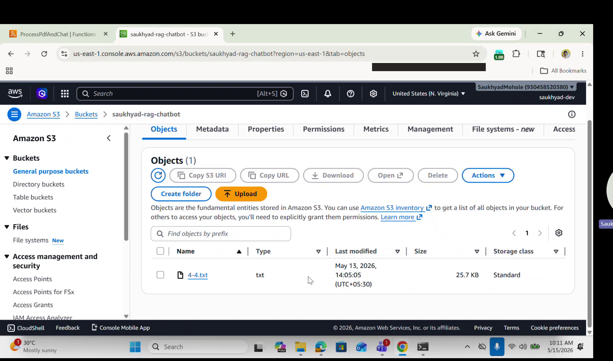
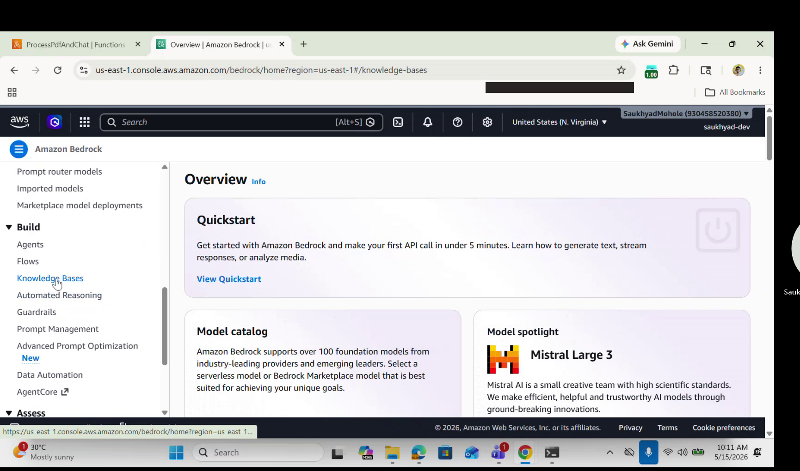
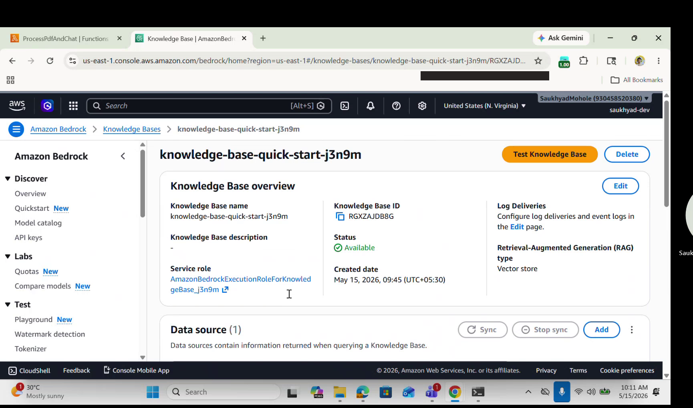
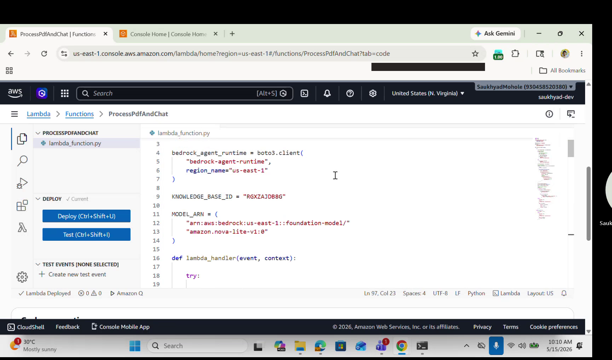
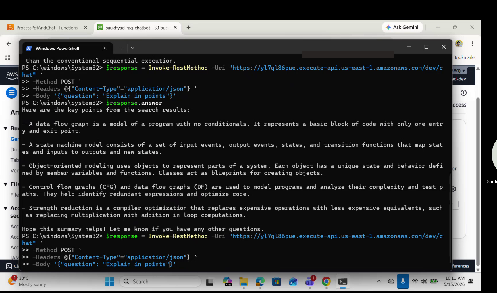
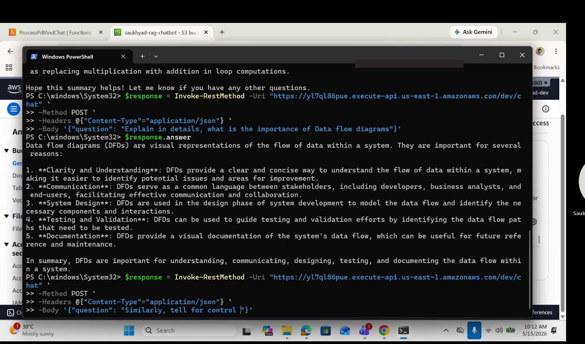
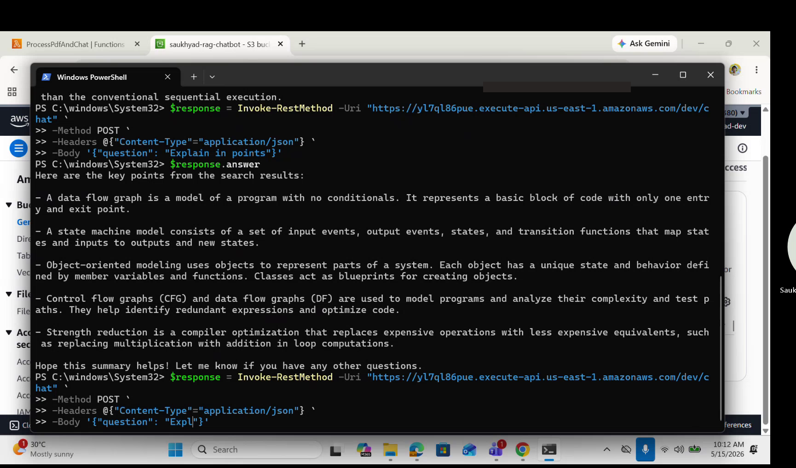

<div align="center">

# 🤖 AWS RAG Chatbot using Amazon Bedrock

**A fully serverless, cloud-native Question-Answering system powered by Retrieval-Augmented Generation (RAG)**

[](https://python.org)
[](https://aws.amazon.com)
[](https://aws.amazon.com/bedrock/)
[](LICENSE)

*This project was developed as part of an independent learning assignment during my summer internship.*

---

</div>

## 📋 Project Overview

This project implements an **AI-powered chatbot** that answers questions from uploaded PDF documents using **Retrieval-Augmented Generation (RAG)** on AWS. The system ingests PDF documents into an Amazon S3 bucket, indexes them through an Amazon Bedrock Knowledge Base backed by OpenSearch Serverless vector store, and exposes a REST API that accepts natural language questions and returns context-aware, accurate answers.

Unlike traditional keyword-search systems, this chatbot **understands context** — it retrieves the most relevant document passages and uses a foundation model (Amazon Nova Lite) to generate human-readable responses grounded in the source material.

---

## 🏗️ Architecture

<div align="center">



</div>

### Workflow

```
User sends a question via REST API
        │
        ▼
Amazon API Gateway (REST)
        │
        ▼
AWS Lambda (Python 3.12)
        │
        ▼
Amazon Bedrock — RetrieveAndGenerate API
        │
  ┌─────┴──────┐
  ▼            ▼
Knowledge    Amazon Nova Lite
  Base       (Foundation Model)
  │
  ▼
OpenSearch Serverless
(Vector Store)
  ▲
  │
Amazon S3
(PDF Documents)
        │
        ▼
Context-aware response returned to user
```

**How it works:**
1. The user sends a natural language question to the REST API endpoint.
2. **API Gateway** receives the HTTPS request and routes it to the Lambda function.
3. **AWS Lambda** parses the question and calls the Bedrock `RetrieveAndGenerate` API.
4. **Amazon Bedrock** queries the **Knowledge Base**, which performs a semantic vector search on **OpenSearch Serverless** to find relevant document chunks from PDFs stored in **S3**.
5. The retrieved context is passed to **Amazon Nova Lite**, which generates a coherent, grounded answer.
6. The response flows back through Lambda → API Gateway → User.

---

## ✨ Features

| Feature | Description |
|---------|-------------|
| ✅ **Retrieval-Augmented Generation** | Combines document retrieval with generative AI for accurate, grounded answers |
| ✅ **Serverless Architecture** | Zero server management — scales automatically with demand |
| ✅ **REST API** | Clean HTTP endpoint for easy integration with any frontend or service |
| ✅ **Amazon Bedrock Integration** | Leverages managed foundation models without provisioning infrastructure |
| ✅ **Knowledge Base Retrieval** | Semantic search across document embeddings for precise context retrieval |
| ✅ **PDF-based Question Answering** | Upload any PDF and ask questions in natural language |
| ✅ **Context-aware Responses** | Answers are generated from actual document content, not hallucinated |
| ✅ **Scalable AWS Deployment** | Built entirely on managed AWS services for production-grade reliability |
| ✅ **CORS Enabled** | Ready for cross-origin frontend integrations |

---

## 🛠️ Tech Stack

| Category | Technology |
|----------|-----------|
| **Language** | Python 3.12 |
| **Cloud Provider** | Amazon Web Services (AWS) |
| **Generative AI** | Amazon Bedrock (RetrieveAndGenerate API) |
| **Foundation Model** | Amazon Nova Lite v1.0 |
| **Compute** | AWS Lambda |
| **API Layer** | Amazon API Gateway (REST) |
| **Vector Store** | Amazon OpenSearch Serverless |
| **Object Storage** | Amazon S3 |
| **Knowledge Base** | Amazon Bedrock Knowledge Base |
| **Security** | AWS IAM (roles & policies) |
| **Monitoring** | Amazon CloudWatch |
| **SDK** | Boto3 |

---

## 📁 Repository Structure

```
AWS-RAG-Chatbot/
│
├── README.md                 # Project documentation (you are here)
├── LICENSE                   # MIT License
├── .gitignore                # Git ignore rules
├── requirements.txt          # Python dependencies
│
├── src/
│   └── lambda_function.py    # AWS Lambda handler (sanitized)
│
├── architecture/
│   └── architecture.png      # System architecture diagram
│
├── docs/
│   └── Project_Report.pdf    # Detailed project report
│
├── screenshots/
│   ├── aws_console.png       # AWS Console — services overview
│   ├── s3_bucket.png         # S3 bucket configuration
│   ├── bedrock_model.png     # Bedrock model access
│   ├── knowledge_base.png    # Knowledge Base setup
│   ├── lambda.png            # Lambda function configuration
│   ├── query1.png            # Test query — programming models
│   ├── query2.png            # Test query — compilers
│   └── query3.png            # Test query — software tools
│
├── sample_documents/
│   └── sample.pdf            # Example document for knowledge base
│
└── postman/
    └── ChatbotAPI.postman_collection.json  # Postman collection for API testing
```

---

## 🚀 Setup & Deployment

### Prerequisites

- AWS Account with Bedrock model access enabled
- AWS CLI configured with appropriate credentials
- Python 3.12+

### Step 1 — Create S3 Bucket & Upload Documents

```bash
aws s3 mb s3://your-rag-documents-bucket
aws s3 cp ./sample_documents/sample.pdf s3://your-rag-documents-bucket/
```

### Step 2 — Create Bedrock Knowledge Base

1. Navigate to **Amazon Bedrock** → **Knowledge Bases** in the AWS Console.
2. Create a new Knowledge Base pointing to your S3 bucket.
3. Select **Amazon OpenSearch Serverless** as the vector store.
4. Sync the data source.
5. Note down the **Knowledge Base ID**.

### Step 3 — Deploy Lambda Function

1. Create a new Lambda function with **Python 3.12** runtime.
2. Upload `src/lambda_function.py` as the handler.
3. Set the following **environment variables**:

   | Variable | Description | Example |
   |----------|-------------|---------|
   | `KNOWLEDGE_BASE_ID` | Your Bedrock Knowledge Base ID | `ABCDEF1234` |
   | `MODEL_ARN` | Foundation model ARN | `arn:aws:bedrock:us-east-1::foundation-model/amazon.nova-lite-v1:0` |

4. Attach an **IAM role** with the following permissions:
   - `bedrock:InvokeModel`
   - `bedrock:Retrieve`
   - `bedrock:RetrieveAndGenerate`
   - `s3:GetObject` (on your document bucket)
5. Set timeout to **30 seconds** (Bedrock responses may take a few seconds).

### Step 4 — Create API Gateway

1. Create a **REST API** in API Gateway.
2. Create a `/chat` resource with a **POST** method.
3. Set the integration type to **Lambda Function**.
4. Enable **CORS**.
5. Deploy to a stage (e.g., `dev`).

### Step 5 — Test

```bash
curl -X POST https://<your-api-id>.execute-api.<region>.amazonaws.com/dev/chat \
  -H "Content-Type: application/json" \
  -d '{"question": "What is Embedded Systems?"}'
```

---

## 📡 API Reference

### Endpoint

```
POST https://<api-gateway-url>/dev/chat
```

### Request Headers

```
Content-Type: application/json
```

### Request Body

```json
{
  "question": "What are the different models of programs?"
}
```

### Success Response — `200 OK`

```json
{
  "answer": "The different models of programs are:\n\n1. Sequential Program Model: In this model, the functions or processing requirements are executed in sequence, similar to conventional procedural programming. It involves iterating and executing program instructions conditionally, transforming data through a series of operations.\n\n2. Concurrent/Communicating Process Model: This model models concurrently executing tasks/processes, making it easier to implement certain requirements than conventional sequential execution. However, it requires additional overheads in task scheduling, synchronization, and communication."
}
```

### Error Response — `500 Internal Server Error`

```json
{
  "error": "An error occurred while processing the request."
}
```

---

## 📸 Screenshots

> *Screenshots of each AWS service configuration and live test queries.*

<details>
<summary><strong>☁️ AWS Console — Services Overview</strong></summary>
<br>

</details>

<details>
<summary><strong>🪣 S3 Bucket Configuration</strong></summary>
<br>

</details>

<details>
<summary><strong>🧠 Bedrock Model Access</strong></summary>
<br>

</details>

<details>
<summary><strong>📚 Knowledge Base Setup</strong></summary>
<br>

</details>

<details>
<summary><strong>⚡ Lambda Function</strong></summary>
<br>

</details>

<details>
<summary><strong>💬 Query 1 — Programming Models</strong></summary>
<br>

</details>

<details>
<summary><strong>💬 Query 2 — Compilers</strong></summary>
<br>

</details>

<details>
<summary><strong>💬 Query 3 — Software Tools</strong></summary>
<br>

</details>

---

## 🔮 Future Improvements

- [ ] **Streaming Responses** — Implement response streaming for real-time answer generation
- [ ] **Multi-document Support** — Allow querying across multiple knowledge bases
- [ ] **Chat History** — Add DynamoDB-backed conversation memory for follow-up questions
- [ ] **Frontend UI** — Build a React/Next.js chat interface
- [ ] **Authentication** — Add Cognito-based user authentication
- [ ] **Cost Monitoring** — Implement AWS Cost Explorer integration for usage tracking
- [ ] **CI/CD Pipeline** — Add SAM/CDK template for infrastructure-as-code deployment
- [ ] **Guardrails** — Implement Amazon Bedrock Guardrails for content filtering

---

## 🤝 Contributing

Contributions are welcome! Feel free to open an issue or submit a pull request.

1. Fork the repository
2. Create your feature branch (`git checkout -b feature/amazing-feature`)
3. Commit your changes (`git commit -m 'Add amazing feature'`)
4. Push to the branch (`git push origin feature/amazing-feature`)
5. Open a Pull Request

---

## 📄 License

This project is licensed under the MIT License — see the [LICENSE](LICENSE) file for details.

---

<div align="center">

**Built with ❤️ using AWS Serverless & Amazon Bedrock**

</div>
